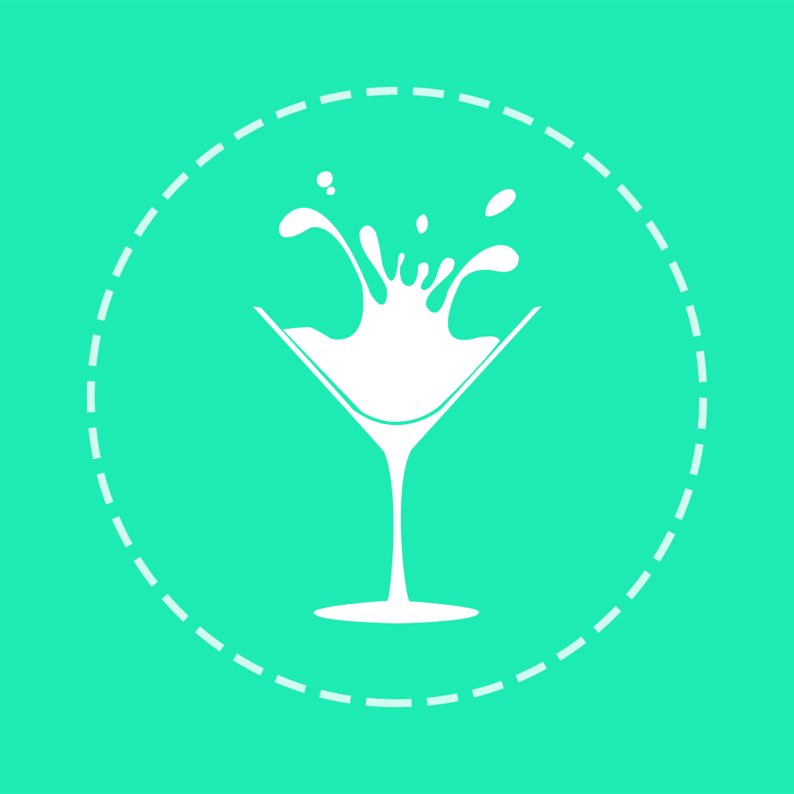
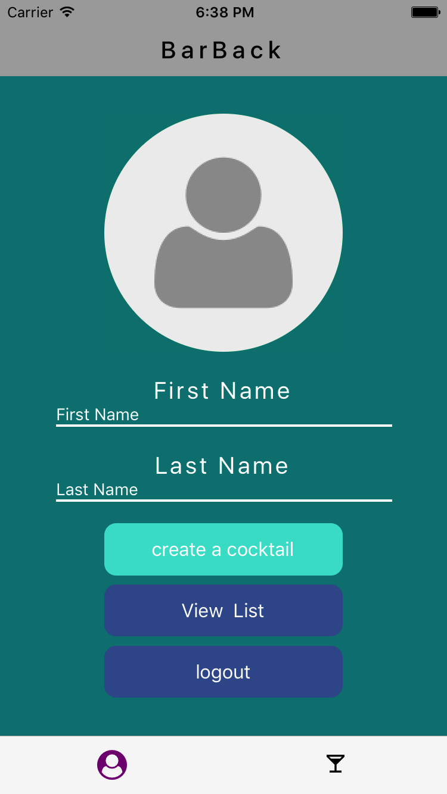
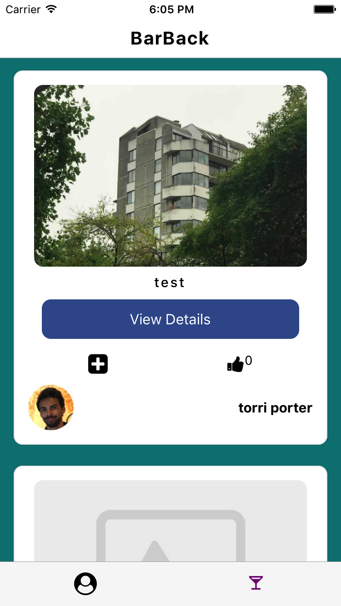
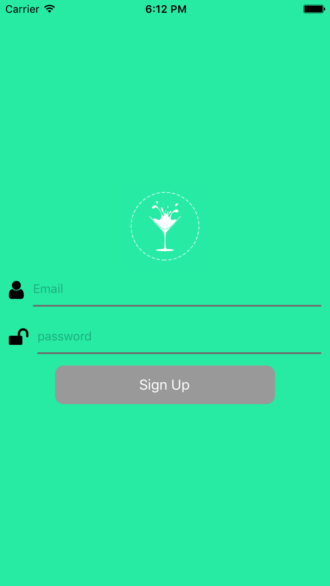
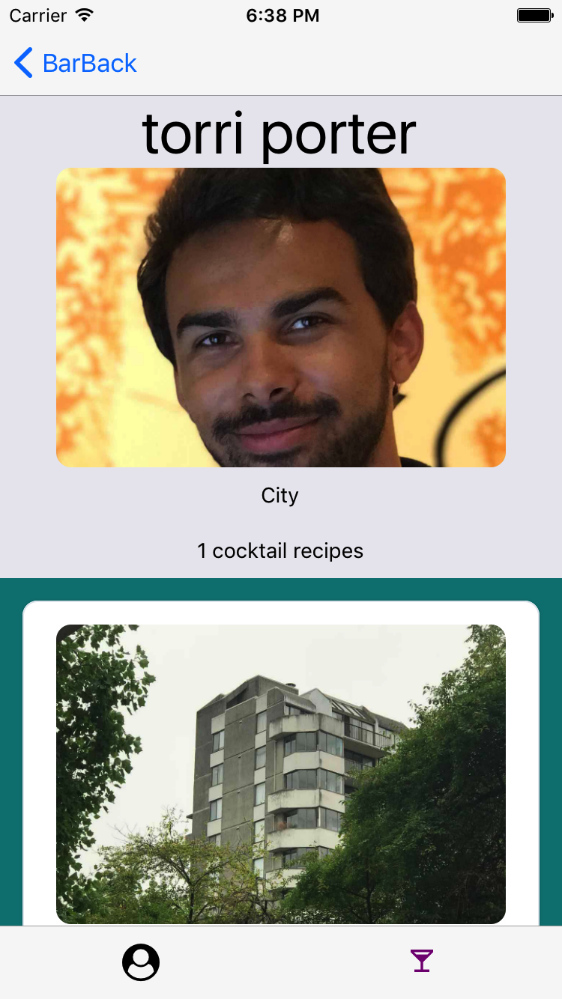

# BarBack

BarBack is a cocktail app that allow users to create their own recipes, users have the ability to like and add users cocktail to their own list. BarBack was built with React Native and expo the database is google firebase.

# Dependencies & Libraries
<ul>
<li>React Native</li>
<li>Expo</li>
<li>Nodejs</li>
<li>Firebase</li>
<li>React Native Elements</li>
<li>React Navigation</li>
<li>React Native Image cache</li>
</ul>

Please check the project on Expo and follow me
https://expo.io/@salman90/bar-back-2
